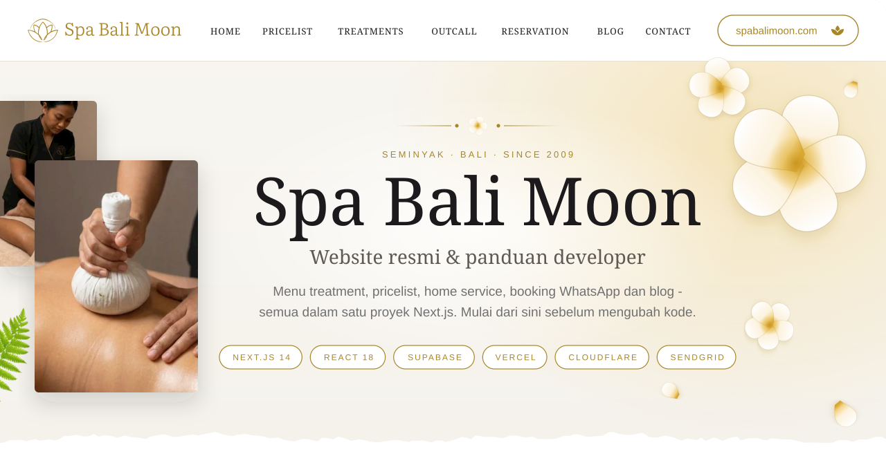
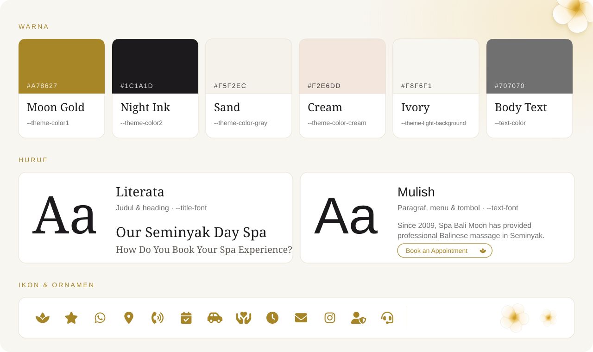
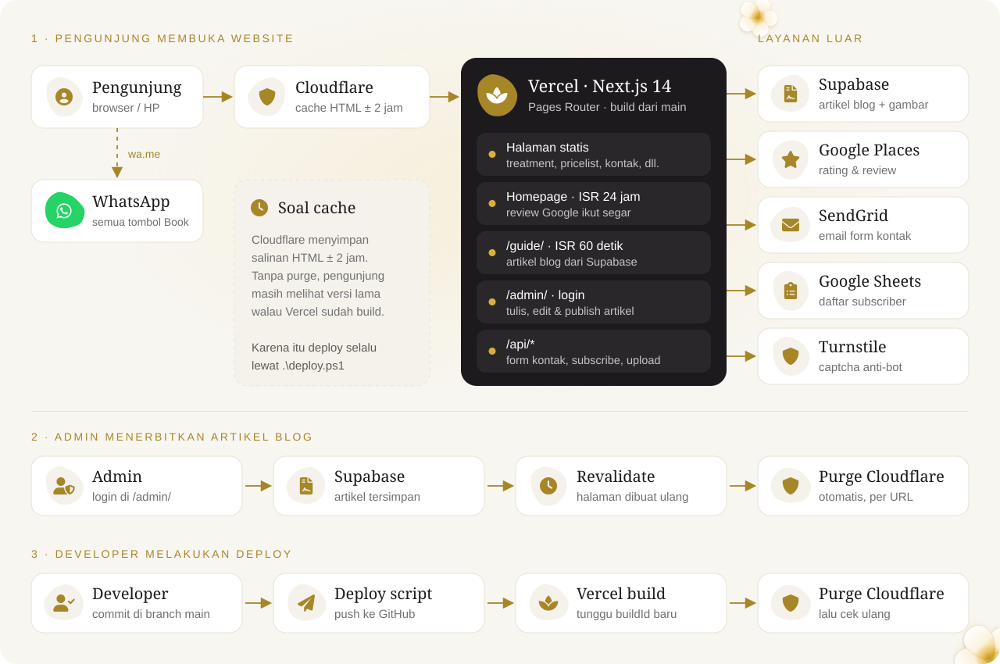
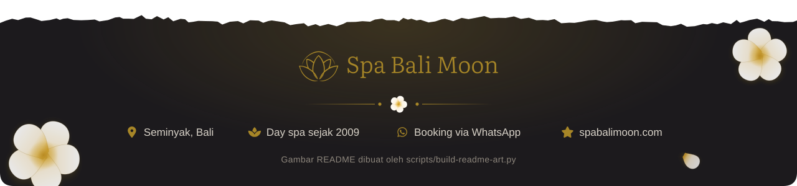

<div align="center">



<a href="#tentang"></a>
<a href="#gaya"></a>
<a href="#mulai"></a>
<a href="#folder"></a>
<a href="#cara-kerja"></a>
<a href="#resep"></a>
<a href="#aturan"></a>
<a href="#deploy"></a>

</div>

<br>

<a id="tentang"></a>


**Spa Bali Moon** adalah day spa di Seminyak, Bali, yang buka sejak 2009: pijat Bali, body treatment, facial, sampai perawatan kuku dan rambut. Tamu bisa datang ke spa, atau terapisnya yang datang ke villa/hotel (*home service*).

Repo ini adalah website resminya, **[spabalimoon.com](https://spabalimoon.com/)**, hasil *rebuild* dari WordPress ke **Next.js**. Tugas website ini sebenarnya sederhana: **menampilkan menu & harga, lalu mengantar pengunjung ke chat WhatsApp untuk booking.**

<table>
<tr>
<td align="center" width="33%"><br><b>23 Halaman Treatment</b><br><sub>Balinese, hot stone, deep tissue, facial, dll. di <code>/seminyak/&lt;slug&gt;/</code></sub></td>
<td align="center" width="33%"><br><b>Pricelist & Paket</b><br><sub>Semua harga dalam satu halaman di <code>/seminyak/</code>, plus paket A–D</sub></td>
<td align="center" width="33%"><br><b>Home Service</b><br><sub>Pijat di villa & hotel:<br><code>/outcall-home-service-massage/</code></sub></td>
</tr>
<tr>
<td align="center" width="33%"><br><b>Booking via WhatsApp</b><br><sub>Semua tombol <i>Book</i> membuka chat WhatsApp. Form kontak mengirim email lewat SendGrid</sub></td>
<td align="center" width="33%"><br><b>Blog "Guide"</b><br><sub>Artikel di <code>/guide/</code>, ditulis lewat panel <code>/admin/</code> dan disimpan di Supabase</sub></td>
<td align="center" width="33%"><br><b>Review Google</b><br><sub>Rating & ulasan diambil dari Google Places, diperbarui tiap 24 jam</sub></td>
</tr>
</table>

| | |
|---|---|
| **Live** | https://spabalimoon.com/ |
| **Hosting** | Vercel (build otomatis dari branch `main`) di belakang Cloudflare (proxy + cache) |
| **Framework** | Next.js 14 (Pages Router) · React 18 · JavaScript, tanpa TypeScript |
| **Database** | Supabase, hanya untuk blog. Menu & harga ditulis langsung di kode |
| **Dev server** | `npm run dev` → http://localhost:3009 |

> [!NOTE]
> Website ini **menggantikan situs WordPress lama** yang sudah punya ranking di Google. Karena itu URL, judul, dan deskripsi SEO sengaja dibuat **sama persis** dengan versi WordPress. Baca [Aturan Emas](#aturan) sebelum mengganti URL apa pun.

<br>

<a id="gaya"></a>




Semua token desain dikumpulkan di satu tempat, jadi kalau mau mengganti warna atau huruf, mulailah dari sini:

| Elemen | Lokasi | Catatan |
|---|---|---|
| Warna & font (CSS variables) | [`public/sass/_abstracts/_variables.scss`](public/sass/_abstracts/_variables.scss) | `--theme-color1` adalah gold utama |
| Font Literata & Mulish | [`public/webfonts/`](public/webfonts) + [`public/css/google-fonts.css`](public/css/google-fonts.css) | *Self-hosted*, tidak memanggil Google Fonts |
| Ikon | Font Awesome 6 Pro, [`public/css/fontawesome.css`](public/css/fontawesome.css) | Sudah di-*subset*, baca peringatan di bawah |
| Bunga frangipani | [`components/elements/Frangipani.js`](components/elements/Frangipani.js) | SVG inline, warnanya ikut palet di atas |
| Logo | [`public/images/logo/`](public/images/logo) | `SMBtitle.svg` (gold) |

> [!WARNING]
> **Font ikon sudah dipangkas** menjadi ±57 ikon yang benar-benar dipakai website (dari 1,1 MB jadi 18 KB). Menambah class `fa-…` baru **tidak akan muncul** sebelum file `public/webfonts/fa-*` di-*subset* ulang dari Font Awesome Pro versi lengkap. Versi lengkapnya masih tersimpan di riwayat git, sebelum commit `0f4c21a`.

> [!TIP]
> Style ditulis dalam SCSS. Selama mengedit `public/sass/…`, biarkan `npm run sass` berjalan (mode *watch*). Hasil compile-nya, `public/css/style.css`, **ikut di-commit**, karena file itulah yang di-import `pages/_app.js`.

<br>

<a id="mulai"></a>


**Yang perlu ter-install:** Node.js 18.17 atau lebih baru, npm, dan Git. Opsional: Python 3 + Pillow (kompres gambar) dan ffmpeg (kompres video).

```bash
git clone https://github.com/algosbiz/spa.git
cd spa
npm install
cp .env.example .env.local    # isi nilainya, minta ke pemilik project
npm run dev                   # buka http://localhost:3009
```

Halaman biasa tetap tampil walaupun `.env.local` masih kosong. Blog, admin, sitemap, form kontak, dan review Google butuh variabel berikut:

| Variabel | Dipakai untuk | Kalau kosong |
|---|---|---|
| `NEXT_PUBLIC_SITE_URL` | URL absolut di structured data (JSON-LD) | Pakai `https://spabalimoon.com` |
| `SENDGRID_API_KEY` · `SENDGRID_FROM_EMAIL` · `CONTACT_TO_EMAIL` · `BUSINESS_NAME` | Email dari form kontak & subscribe | Email tidak terkirim |
| `NEXT_PUBLIC_TURNSTILE_SITE_KEY` · `TURNSTILE_SECRET_KEY` | Captcha Cloudflare Turnstile di form kontak | Pakai *test key* yang selalu lolos. Jangan dibiarkan kosong di production |
| `NEXT_PUBLIC_SUPABASE_URL` · `SUPABASE_SERVICE_ROLE_KEY` | Database blog + upload gambar (bucket `images`) | Blog & admin tidak jalan |
| `ADMIN_PASSWORD` · `SESSION_SECRET` | Login panel `/admin/` | Tidak bisa login. `SESSION_SECRET` jatuh ke nilai dev yang tidak aman |
| `GOOGLE_PLACES_API_KEY` · `GOOGLE_PLACE_ID` | Rating & review Google di homepage | Pakai kartu bintang 5 & testimoni statis |
| `GOOGLE_SHEET_WEBAPP_URL` | Simpan email subscriber ke Google Sheets ([panduan](google_sheet_instructions.md)) | Dilewati. *Belum tercantum di `.env.example`* |
| `CLOUDFLARE_ZONE_ID` · `CLOUDFLARE_API_TOKEN` | Purge cache setelah deploy & setelah artikel disimpan | Purge dilewati |

> [!CAUTION]
> `.env.local` berisi kunci rahasia dan **tidak boleh di-commit** (sudah masuk `.gitignore`). Di production, semua variabel diisi di dashboard Vercel → *Project → Settings → Environment Variables*.

**Perintah yang sering dipakai**

| Perintah | Fungsi |
|---|---|
| `npm run dev` | Dev server di http://localhost:3009 |
| `npm run build` lalu `npm start` | Build & jalankan versi production secara lokal |
| `npm run sass` | Watch SCSS → `public/css/style.css` |
| `npm run lint` | Cek kode dengan ESLint |
| `npm run purge` | Hapus cache Cloudflare (biasanya cukup lewat `deploy.ps1`) |
| `python scripts/optimize-images.py --dry-run` | Cek dulu gambar mana yang akan dikompres; tanpa `--dry-run` untuk menjalankan |
| `python scripts/make-hero-variants.py` | Buat versi HP (`-sm.webp`) untuk gambar hero |
| `sh scripts/optimize-video.sh <file.mp4>` | Kompres video |
| `node scripts/seed-guide-posts.mjs` | Cek sinkronisasi artikel guide ke Supabase; tambah `--apply` untuk menulis |
| `node scripts/find-google-place-id.mjs "Spa Bali Moon Seminyak"` | Cari nilai `GOOGLE_PLACE_ID` |
| `python scripts/build-readme-art.py` | Gambar ulang semua artwork di README ini |

<br>

<a id="folder"></a>


```text
spa/
├── pages/                    Setiap file = satu URL (Next.js Pages Router)
│   ├── index.js              /                     homepage
│   ├── seminyak/index.js     /seminyak/            pricelist
│   ├── seminyak/*.js         /seminyak/<slug>/     cuma re-export 1 baris dari pages/<treatment>.js
│   ├── <treatment>.js        isi halaman treatment (hot-stone-massage.js, dll.)
│   ├── guide/                /guide/               blog, datanya dari Supabase
│   ├── admin/                /admin/               panel penulis blog (perlu login)
│   ├── api/                  form kontak, subscribe, review Google, API admin
│   └── sitemap.xml.js        /sitemap.xml
├── components/
│   ├── layout/               Header, Footer, Layout, PageHead (meta SEO)
│   ├── sections/             blok halaman: Banner, Pricing, Faq, Testimonial, ...
│   └── elements/             komponen kecil: WhatsAppButton, Frangipani, Accordion, ...
├── lib/                      data & helper: seo.js, whatsapp.js, supabase.js, homepageTreatments.js, ...
├── public/
│   ├── images/               semua gambar (WebP, sudah dikompres)
│   ├── sass/  ──►  css/      SCSS sumber ──► CSS hasil compile
│   └── webfonts/             Literata, Mulish, Font Awesome (self-hosted)
├── scripts/                  kompres gambar/video, purge cache, seed blog, artwork README
├── supabase/schema.sql       tabel `posts` untuk blog
├── docs/readme/              gambar-gambar README ini (hasil scripts/build-readme-art.py)
├── _archive/                 konten asli WordPress & desain lama, hanya referensi
├── next.config.js            redirect URL lama + header cache
└── deploy.ps1                push ──► tunggu Vercel ──► purge Cloudflare
```

**Tiga hal yang sering membingungkan developer baru:**

1. **Isi halaman treatment ada di `pages/<nama>.js`**, bukan di `pages/seminyak/`. File di `pages/seminyak/` hanya berisi `export { default } from "../balinese-massage";`. URL lama di root (mis. `/hot-stone-massage/`) otomatis di-*redirect* 301 ke `/seminyak/…`, dan pemetaan namanya ada di `treatmentSlugMap` dalam [`next.config.js`](next.config.js). Contoh: `pages/bali-moon-facial.js` tayang di `/seminyak/facial/`.
2. **Ada 15 varian Header dan 4 Footer** peninggalan theme. Hampir semua halaman memakai `<Layout HeaderStyle="one" FooterStyle="two">`, yaitu `Header1.js` + `Footer2.js`.
3. **File seperti `index-1-dark.js`, `index-4-single.js`, `shop-*.js`, `team.js`, dan `page-gallery.js` adalah sisa demo theme** yang tidak di-*port*. Semuanya `noindex`. Abaikan, dan jangan dijadikan contoh.

<br>

<a id="cara-kerja"></a>




- **Hampir semua halaman statis.** Treatment, pricelist, kontak, dan lainnya di-*generate* saat build. Mengubah isinya berarti edit kode, lalu deploy.
- **Homepage di-*rebuild* otomatis tiap 24 jam** (ISR), supaya rating & review Google tetap segar.
- **Blog `/guide/` dibaca dari Supabase** dan di-*rebuild* paling lambat tiap 60 detik. Saat admin menyimpan artikel, halaman langsung di-*revalidate* dan cache Cloudflare-nya di-*purge* otomatis ([`lib/publishCache.js`](lib/publishCache.js)).
- **Booking tidak lewat server.** Tombol *Book* hanyalah link `wa.me`. Helper-nya ada di [`lib/whatsapp.js`](lib/whatsapp.js).
- **Gambar disajikan apa adanya dari `/public`** lewat `` biasa, tanpa `next/image`. Artinya ukuran file di disk sama dengan yang di-download pengunjung.

<br>

<a id="resep"></a>


Belum ada "satu sumber data" untuk harga dan kontak. Satu informasi bisa tersalin di banyak file, jadi **selalu cari nilai lamanya di seluruh repo** dan ubah semuanya sekaligus.

| Mau… | Edit di | Hati-hati |
|---|---|---|
| **Ubah harga** | Sampai 5 tempat: [`lib/homepageTreatments.js`](lib/homepageTreatments.js), [`pages/seminyak/index.js`](pages/seminyak/index.js), [`Home5/PackagePricing.js`](components/sections/Home5/PackagePricing.js), [`pages/outcall-home-service-massage.js`](pages/outcall-home-service-massage.js), dan halaman treatment-nya (`pages/<treatment>.js`) | Di halaman outcall, satu treatment bisa muncul dua kali (tab berbeda) |
| **Ubah alamat** | 24 file: 15 varian `Header*.js`, `Footer2.js`, `Footer4.js`, `ContactInner.js`, `PrivacyPolicyInner.js`, `contact/MapPanel.js`, `pages/contact.js`, `pages/index.js` (FAQ), email di `pages/api/contact.js` & `subscribe.js` | Ada 2 format, pendek & lengkap. Cari kata `Pangkung`. `MapPanel.js` juga menyimpan link Google Maps |
| **Ubah nomor WhatsApp** | [`lib/whatsapp.js`](lib/whatsapp.js) + ±60 file yang masih *hard-code* | Cari `6287863175144`. Kode baru sebaiknya import dari `lib/whatsapp.js` |
| **Tulis / ubah artikel blog** | Panel **`/admin/`**, bukan di kode | Tayang ≤ 1 menit, cache di-*purge* otomatis |
| **Ubah judul & deskripsi SEO** | [`lib/seo.js`](lib/seo.js). Untuk artikel blog: field SEO di `/admin/` | Harus tetap cocok dengan situs lama, lihat [Aturan Emas](#aturan) |
| **Tambah gambar** | Taruh di `public/images/…`, lalu `python scripts/optimize-images.py` | Pakai WebP. Gambar hero juga butuh versi HP (`make-hero-variants.py`) |
| **Tambah foto treatment** | `public/images/services/<folder>/<folder>-<n>.webp` | Nomor urutnya dibaca [`lib/treatmentImages.js`](lib/treatmentImages.js) |
| **Ubah warna / style** | `public/sass/…`, lalu `npm run sass` | Commit juga `public/css/style.css` |
| **Ganti URL / slug** | `pages/…` + redirect 301 di [`next.config.js`](next.config.js) | Jangan pernah menghapus URL lama tanpa redirect |

<br>

<a id="aturan"></a>


> [!IMPORTANT]
> **1. URL & SEO tidak boleh berubah diam-diam.**
> Semua URL memakai *trailing slash* (`/seminyak/`, bukan `/seminyak`). Beberapa slug memang terlihat "tidak logis", misalnya `/seminyak/facial/`, `/seminyak/couple-spa/`, `/seminyak/nail-spa/`, dan `/seminyak/sport-massage/`, karena mengikuti URL WordPress yang sudah ranking. Kalau slug harus berubah, **wajib** tambahkan redirect 301 di `next.config.js`. Redirect lama dari WordPress (`/spa-treatments/…`, `/blog` → `/guide/`, dll.) juga harus tetap ada.

> [!IMPORTANT]
> **2. Kompresi gambar tetap ON.**
> Jangan menambahkan `compress: false` atau mematikan optimasi apa pun di `next.config.js`. Setiap gambar baru dikompres dulu dengan `scripts/optimize-images.py`. Foto dari klien yang bernama `.webp` sering ternyata PNG berukuran ratusan KB, jadi cek ukurannya sebelum di-commit.

> [!IMPORTANT]
> **3. Deploy selalu lewat `.\deploy.ps1`**, bukan sekadar `git push`. Alasannya ada di bagian [Deploy](#deploy).

4. **Jalankan satu `npm run dev` saja.** Dua dev server yang berbagi folder `.next` membuat route & CSS macet. Kalau sudah terjadi: hentikan semuanya, hapus folder `.next`, lalu jalankan ulang satu.
5. **Kunci rahasia hanya di server.** `SUPABASE_SERVICE_ROLE_KEY` dan kunci lain tanpa awalan `NEXT_PUBLIC_` hanya boleh dipakai di API route atau `getStaticProps`/`getServerSideProps`, jangan di komponen client.
6. **Baca komentar di kode sebelum "merapikan".** Banyak bagian yang kelihatan aneh (preloader di `pages/_app.js`, header yang di-load dinamis di `Layout.js`, isi `robots.txt`) sudah dijelaskan alasannya di komentar. Biasanya alasannya SEO atau kecepatan halaman.

<br>

<a id="deploy"></a>


Website di-*host* di **Vercel**, yang otomatis build setiap ada push ke `main`, dan berada di belakang **Cloudflare** yang menyimpan cache HTML ±2 jam. Karena cache itu, `git push` saja tidak cukup: pengunjung masih akan melihat versi lama. Script `deploy.ps1` menjalankan urutan yang benar, yaitu push, menunggu build baru benar-benar tayang, purge cache, lalu cek ulang lewat Cloudflare.

```powershell
.\deploy.ps1                          # push commit yang ada, tunggu build tayang, purge, cek
.\deploy.ps1 -Message "ubah harga"    # stage semua perubahan + commit, lalu langkah di atas
.\deploy.ps1 -CheckOnly               # lihat build yang sedang tayang, tidak mengubah apa pun
.\deploy.ps1 -PurgeOnly               # hanya purge cache (build sudah tayang)
```

- Jalankan dari root repo di PowerShell. Script membaca `CLOUDFLARE_ZONE_ID` dan `CLOUDFLARE_API_TOKEN` dari `.env.local`.
- Kalau langkah verifikasi gagal ("masih build lama"), tunggu ±1 menit lalu jalankan `.\deploy.ps1 -CheckOnly`. Sering kali hanya satu edge Cloudflare yang telat. Purge ulang hanya kalau memang masih basi.
- Otomatisasi purge lewat GitHub Actions **sudah pernah dicoba dan dibatalkan** karena runner tidak bisa membaca secret-nya. Jangan dibuat ulang tanpa informasi baru.

### Bacaan lanjutan

| Dokumen | Isi |
|---|---|
| [`cloudflare_cache_instructions.md`](cloudflare_cache_instructions.md) | Setup Cache Rules di Cloudflare |
| [`google_sheet_instructions.md`](google_sheet_instructions.md) | Menyimpan subscriber ke Google Sheets |
| [`google_sheet_sender_instructions.md`](google_sheet_sender_instructions.md) | Mengirim email promo dari Google Sheets |
| [`supabase/schema.sql`](supabase/schema.sql) | Skema tabel blog |
| [`_archive/wordpress-content/`](_archive/wordpress-content) | Teks asli dari situs WordPress |

<br>


